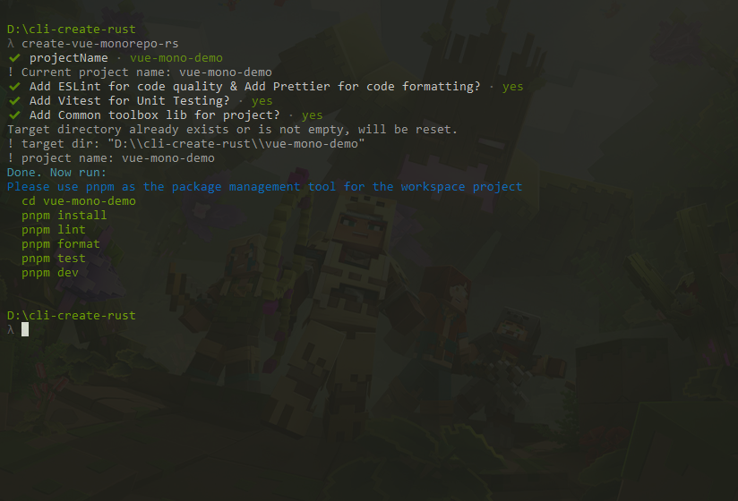

# `create-vue-monorepo-rs`

> A tool to quickly build a Vue workspace project managed by pnpm.

> Refactor the `create-vue-monorepo` CLI library using Rust. The original library was built using ESM.

| 技术栈       | 版本    |
| :----------- | :------ |
| rust         | 1.71.0  |
| dialoguer    | 0.11.0  |
| tempfile     | 3.5.0   |
| thiserror    | 1.0.40  |
| console      | 0.15.5  |
| termcolor    | 1.2.0   |
| regex        | 1.7.3   |
| serde        | 1.0.159 |
| serde_json   | 1.0.95  |
| serde_derive | 1.0.159 |
| git2         | 0.18.1  |

## 使用

> 目前仅支持`cargo install`安装方式

- 下载安装

```shell
cargo install create-vue-monorepo-rs
```

- 使用

```shell
# 输入create-vue-monorepo-rs，按回车键即可
create-vue-monorepo-rs
```



## 开发指南

- 下载&安装依赖

```shell
git clone https://github.com/laqudee/create-vue-monorepo-rs.git

cd create-vue-monorepo-rs

cargo install

cargo run
```

- 构建正式包

```shell
cargo build --release
```

- 发布到`crates.io`

```shell
cargo publish
```

## 构建过程

1. 首先将模板`template`放到根目录下，分为`base`，`code`， `config`这三个子目录，根据选择的配置不同，进行渲染。
2. 使用`dialoguer`库，生成命令行配置选择
3. 根据选择的配置，执行`render()`函数进行渲染
4. 使用`git2`库初始化 git
5. 渲染完成，输出提示信息
6. 退出程序

## 待解决的问题

1. [x] ~~使用 Rust 操作文件及目录~~
2. [x] ~~文件渲染~~
3. [ ] 命令打包的方式及提供几种构建方式
   - 目前支持`cargo install create-vue-monorepo-rs`方式安装使用
4. [x] ~~`git2`库没有生效~~
5. [ ] 生成的`package.json`内容按照字母顺序排序了，不符合正常的`package.json`顺序
6. [ ] 是否转为 npm 命令

### 使用Rust写的CLI工具库

- [`create-vue-monorepo-rs`](https://github.com/laqudee/create-vue-monorepo-rs)

- [`create-vue-business`](https://github.com/laqudee/create-vue-business-rs)

### 已经发布的Crate包

- [`create-vue-monorepo-rs`](https://crates.io/crates/create-vue-monorepo-rs)

- [`create-vue-business-rs`](https://crates.io/crates/create-vue-business-rs)

### 原版使用JavaScript写的CLI工具库

- [`create-vue-monorepo`](https://github.com/laqudee/create-vue-monorepo)，仿照create-vue写了一个生成一个pnpm monorepo 的工作仓库的简单CLI

- [`create-vue-business`](https://github.com/laqudee/create-vue-business)，仿照create-vue写了一个生成一个 pnpm monorepo 的工作仓内部packages目录下业务项目的 CLI


### 已经发布的NPM包

- [`create-vue-monorepo`](https://www.npmjs.com/package/create-vue-monorepo)

- [`create-vue-business`](https://www.npmjs.com/package/create-vue-business)
